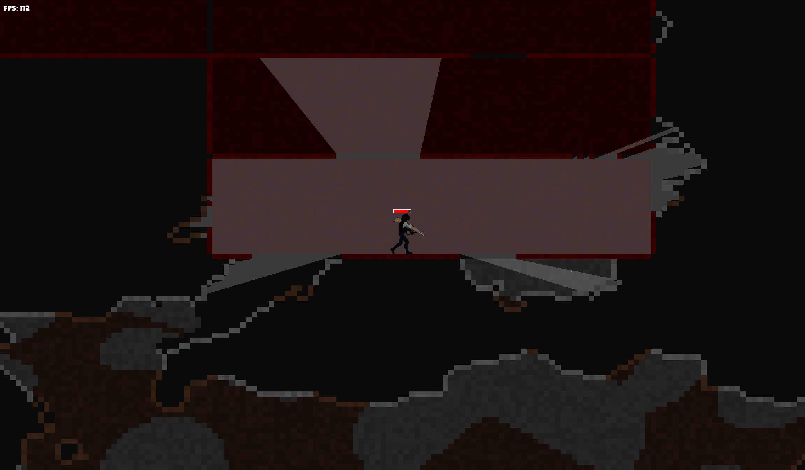

# Current State of the Game

# Big-Picture Goal:

I am building a 2D video game from scratch using:
- ECS architecture
- C++ and only the SFML library (will attempt using lower-level libraries later on)

I will build a 3D game engine (or simulator, something like that) using this game as a template, focusing mainly on the physics, math, and logic. I aim to practice 3D math and physics for use in games, simulators, AR/VR, etc.

## This Repo:

This repo will become my 2D game. It will go private eventually when it starts to grow more and I decide to start selling it.

### Game Features (Completed or In Progress):

This game aims to be a strategic 2D destructible-tile-based shooter. I want to design PvP battle royale, TDM, FFA, etc. playing modes as well as PvE or sandbox modes. Features include:
- random world generation at any size (given enough computer memory) with different tile types (e.g., dirt, stone), caves, structures, and more
- destructible environment (all tiles can be destroyed, with some having more health than others, chances of bullet ricochets, different effects on light, etc.)
- vision physics with ray casting for strategic and immersive experiences
- a variety of weapons (including ranged, melee, explosive, etc.) all with different effects on enemies and the world tiles
- fluid and flexible player movement in both horizontal and vertical directions

### How to Build and Run the Game:

On Mac:
- clone this repo
- download and install CMake (for generating build files) if you don't already have it
  - for homebrew users: `brew install cmake` in terminal
- download and install SFML (Simple and Fast Multimedia Library) 
  - for homebrew users: `brew install sfml` in terminal
- of course, make sure you have a C++ compiler
  - on mac, you can use `xcode-select --install` in the terminal to get Clang which comes with the Xcode command-line tools
- create a build directory in the main project folder (same level and src, bin, etc.)
- navigate inside the build directory in the terminal and type:
  - `cmake ..` (run cmake on parent folder where CMakeLists.txt is and put all generated files here in build folder)
  - `make` (remember to retype this after making changes to the code if you do)
- To run the game, type `./Game` while in the build directory

Alternative:
- just email me and I can talk about it and show it to you

Notes:
- the menu screen is not related to the game yet, just hit enter on any level to generate the random world
- you can play with the world size by changing `worldMaxCells` in the Globals.hpp file